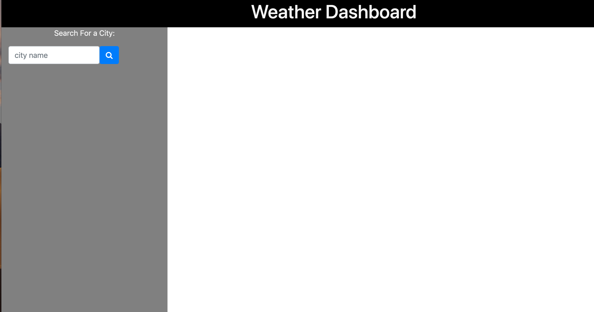
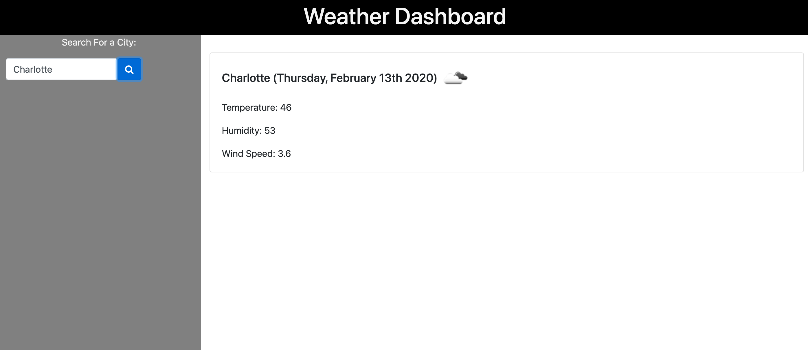
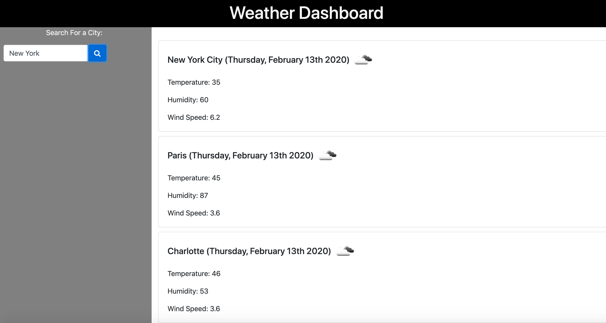

# WeatherDashboard
This is a weather dashboard application with search functionality to find current weather conditions - temperature, humidity and wind speed - for multiple cities on a given day. 

![deployedsite] https://dorinetk.github.io/WeatherDashboard/

![Repository]https://github.com/Dorinetk/WeatherDashboard 

View of the application steps:

